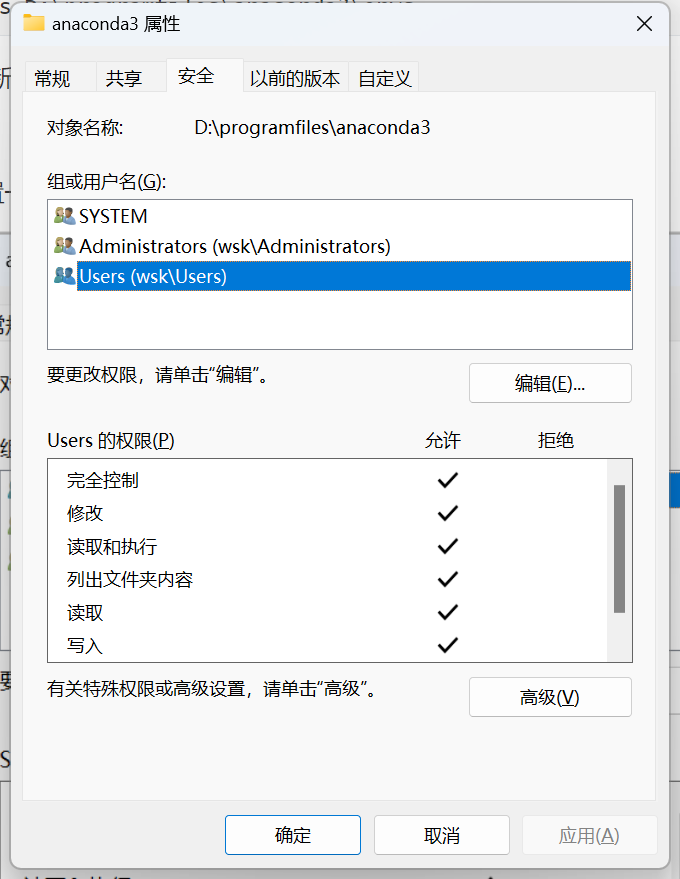

# Anaconda的相关问题

## 请使用cmd

把你的Anaconda文件位置添加到环境变量，目的是为了在cmd中执行conda，不需要Anaconda自带的终端`Anaconda Prompt`

```bash
D:\programfiles\anaconda3
D:\programfiles\anaconda3\Scripts
```

## 修改环境默认位置

查看环境位置信息

```bash
conda info
```

默认的环境安装路径在envs directories中，第一个路径就是默认的

你可以自行添加环境路径：

```bash
conda config --add envs_dirs D:\programfiles\anaconda3\envs
```

但有时候，由于权限的问题，你在新建环境时，默认位置仍是C盘那个隐藏文件夹

这就搞人心态了

去Anaconda安装文件夹那里，设置一下文件夹的属性：修改Users的属性，全给他勾上，确定，等待半分钟差不多。



