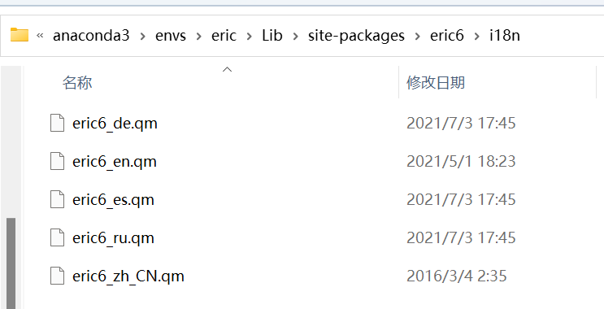

# Pyqt5+Eric

## 虚拟环境

妈的，python版本别太高，用3.11的装好后，直接闪退了，==3.8==差不多的了

虚拟环境的名字就叫eric好了，以后也不会用

```bash
conda create -n eirc python=3.8
```

## 安装PyQt5

activate到你的虚拟环境下

```bash
activate eric
```

执行

```bash
pip install PyQt5
```

安装Qt的相关工具

```bash
pip install PyQt5-tools
```

## 安装Eric

还好之前睿智，把旧版本的eric6备份了，现在官网只能下eric7，当然，你完全可以用eric7+PyQt6这套组合，如果不嫌麻烦的话。

我装的是eric6-21.11

安装Qsic模块

```bash
pip install QScintilla
```

cd到eric6-21.11文件路径，执行

```bash
python install.py
```

恭喜你，装好了

## 汉化

如果英语好，请滚出中国

把我的汉化包eric6_zh_CN.qm放到你安装的eric6的语言文件夹下：

我的在这`D:\programfiles\anaconda3\envs\eric\Lib\site-packages\eric6\i18n`



