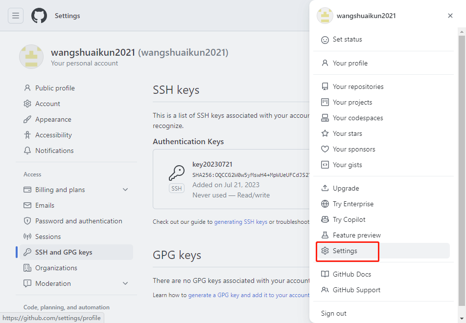
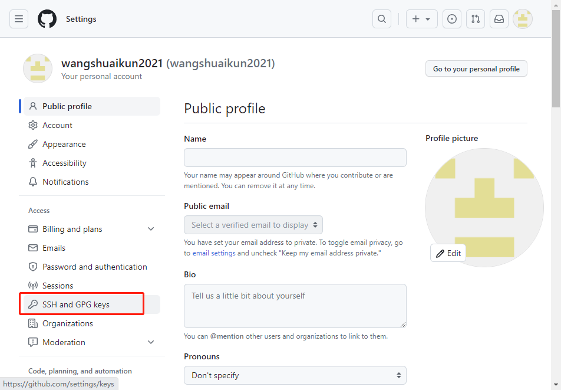
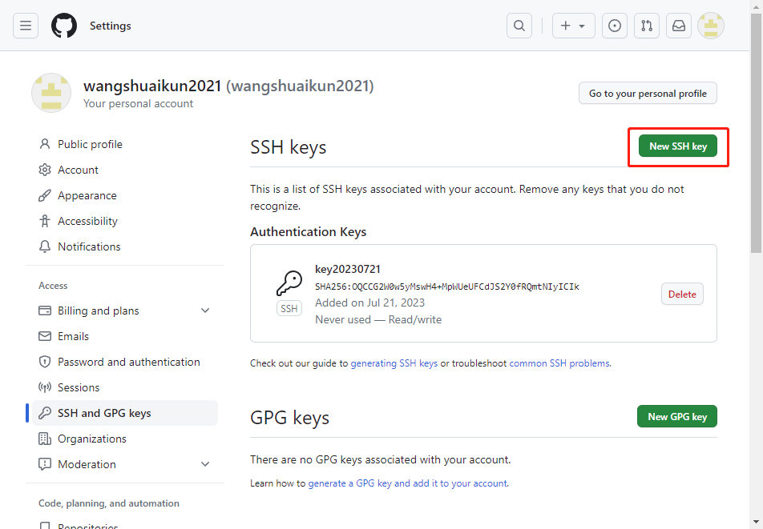
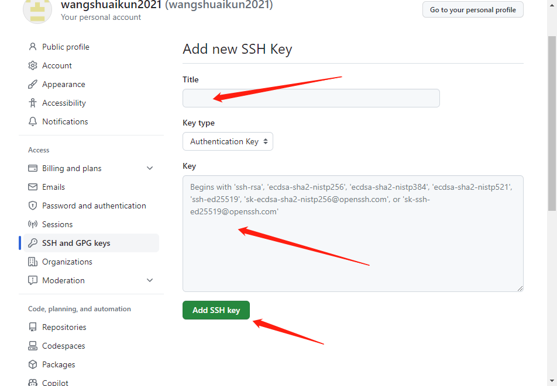
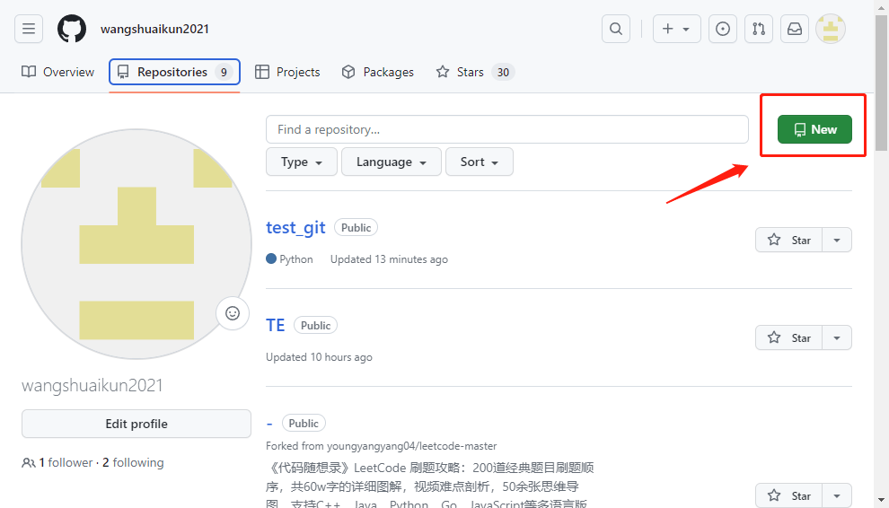
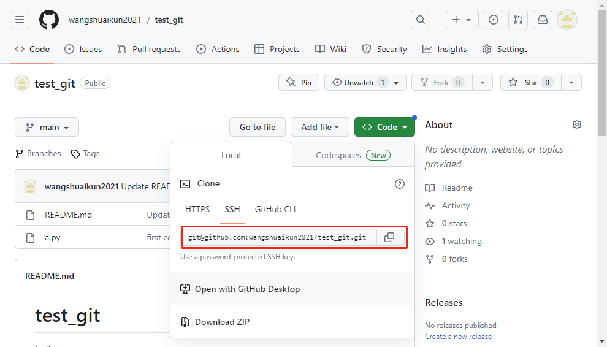
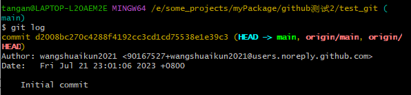
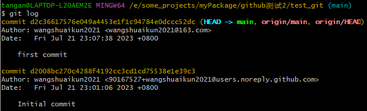
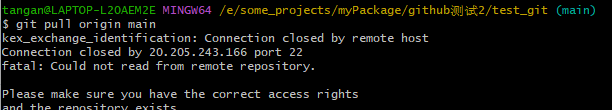

# [安装Git](https://git-scm.com/download/)

- 一路默认就行了
- 打开Git Bash
- 绑定用户名和邮箱，就是你github的用户名和邮箱

```bash
git config --global user.name "wangshuaikun2021"
git config --global user.email "wangshuaikun2021@163.com"
```

- 黑人的命也是命，请把你的默认分支改为`main`

```bash
git config --global init.defaultbranch=main
```

- `git config --list`可以查看git的配置信息

- 生成秘钥

```bash
ssh-keygen -t rsa -C "wangshuaikun2021@163.com"
```


- 到秘钥生成的文件夹下，找到`id_rsa.pub`，打开，复制秘钥

- 将秘钥添加到你的github账号上









- 随便取个名字，把秘钥站进去，添加即可

# 上传下载项目

- 常用指令

- 基本配置

  - git --version：返回版本号
  - git --help：帮助文档
  - git config --list：查看所有配置
  - git config --list --show-origin：查看所有配置以及它们所在的文件
  - git config --global user.name "用户名"：全局配置用户名
  - git config --global user.email 邮箱地址：全局配置邮箱
  - git config user.name：查看用户名
  - git config user.email：查看邮箱

  我们在 GitHub 的每次提交理论上都会在 主页的下面产生一条绿色小方块的记录，如果你确认你提交了，但是没有绿色方块显示，那肯定是你提交代码配置的邮箱跟你 GitHub 上的邮箱不一致，GitHub 上的邮箱可以到 Setting -> Emails里查看。

- 基本操作

  - git status ：查看仓库状态

  - git init：创建一个空仓库，或者重新初始化一个已有仓库

  - git add：把文件添加到可提交列表（临时缓冲区）

  - git commit：提交改动（增删改）至仓库

  - git log：打印提交日志

  - git branch：查看、添加、删除分支

  - git checkout：切换分支、标签

  - git merge：合并分支

  - git tag：新建、查看标签

  - git clone：下载仓库

```bash
git init //把这个目录变成Git可以管理的仓库
git add README.md //文件添加到仓库
git add . //不但可以跟单一文件，还可以跟通配符，更可以跟目录。一个点就把当前目录下所有未追踪的文件全部add了 
git commit -m "first commit" //把文件提交到仓库
git remote add origin git@github.com:wangjiax9/practice.git //关联远程仓库
git push -u origin master //把本地库的所有内容推送到远程库上
```

- 在github新建一个仓库




- 复制SSH地址



- 在你本地的一个空文件夹下打开Git Bash，克隆到本地

  ```bash
  git clone git@github.com:wangshuaikun2021/test_git.git
  ```

- 会多一层文件夹，cd到那里面

- `git log`可以查看git的日志信息

  

- 然后就可以开始你的项目了，比如新建了一个py文件，`a.py`，只需要`git add`然后`git commit`然后`git push`到github上即可，具体如下：

  ```bash
  git add --all
  git commit -m "first commit"
  git push origin main
  ```

- 你可以随时`git log`查看日志信息

  

- 如果你的远程仓库更新了，你想更新到本地，pull就行了

  ```bash
  git pull origin main
  ```

- pull的时候有时候因为网络问题会报错，提示你连接关闭了，多试几次就行了

  

# 如果你先有项目，再上传

只需要在你的项目文件夹下打开Git Bash

然后初始化

然后连接到远程仓库

```bash
git remote add origin git@github.com:wangshuaikun2021/mytricks.git
```

接下来跟git clone下来的操作一样了
