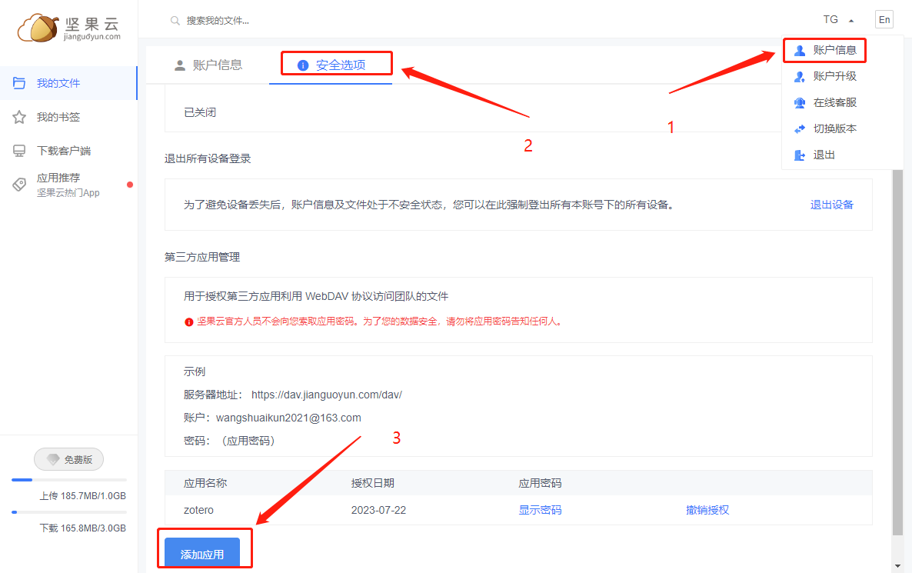
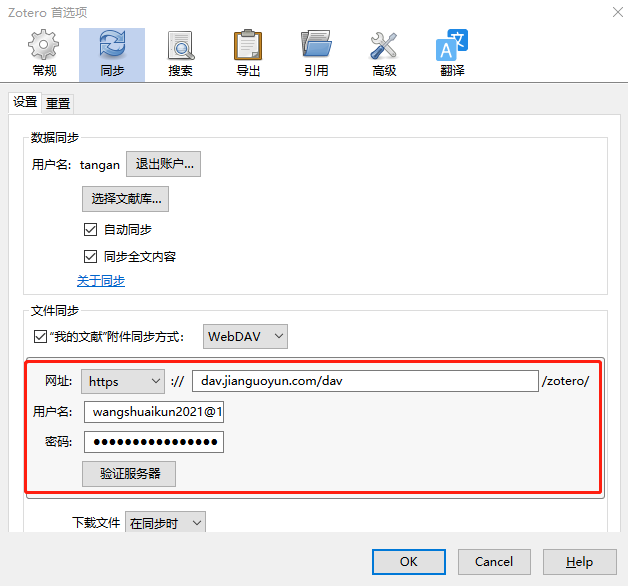
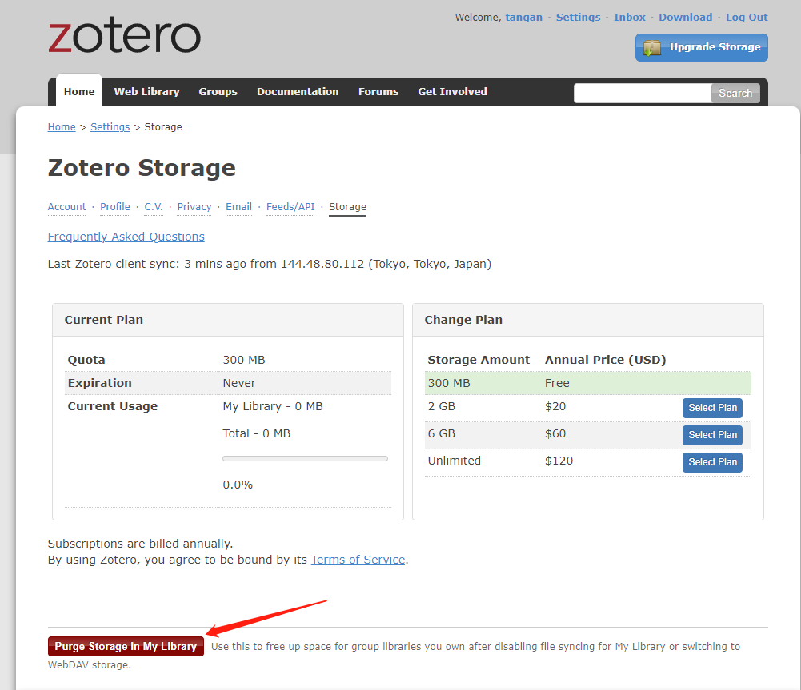

# 开始

zotero只提供300MB免费空间

推荐使用坚果云，每个月上传流量的上限是1GB，而且累加

# 注册坚果云

[地址](https://www.jianguoyun.com/)

# 更改同步方式

打开zotero首选项，按图办事，记得点OK，然后重启zotero，他就会把所有数据同步到坚果云

# 清楚原zotero网盘数据

登录zotero官网，进入web library，去storage里清楚以前的全部数据

