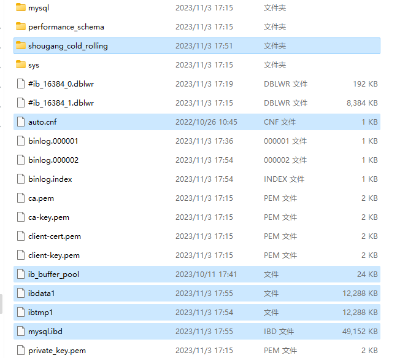

# 关于首钢数据库数据迁移问题

## mysql配置

命令行配置MySQL即可

依次为：

管理员打开cmd

cd到你的mysql安装包的bin文件夹下

初始化mysql

```bash
mysqld --initialize --console
```

开启mysql服务

```bash
net start MySQL
```

登录验证mysql是否安装成功，密码你知道

```bash
mysql -u root -p
```

修改密码

```bash
alter user 'root'@'localhost' identified by 'root';
```

再次推出验证新密码

```bash
exit

mysql -u root -p
```

Enjoy!

配置环境变量可以直接在cmd用sql语句：

新建一个到bin的Path路径即可。


在mysql目录下创建一个ini文件，便于自定义一些东西。

```bash
[mysqld]
character-set-server=utf8mb4
bind-address=0.0.0.0
port=3306
default-storage-engine=INNODB
[mysql]
default-character-set=utf8mb4
[client]
default-character-set=utf8mb4

```

## 数据迁移

相信我，别搞乱七八糟的，直接把原data文件夹的关于shougang的数据粘贴到你的data文件夹下就行。这才真的是小而美！粘这几个文件就行，哦对，站之前先把mysql服务关掉，粘完后重启服务就行

