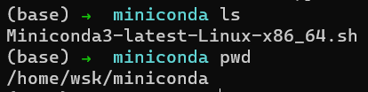
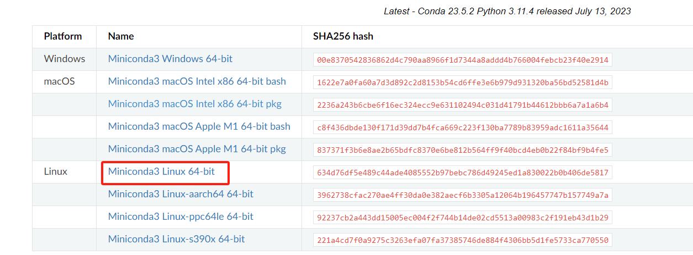
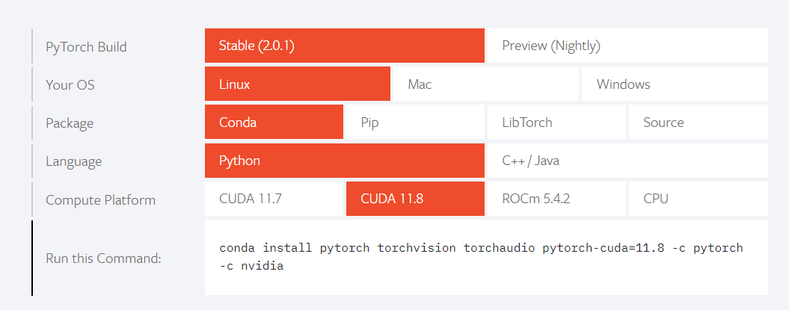
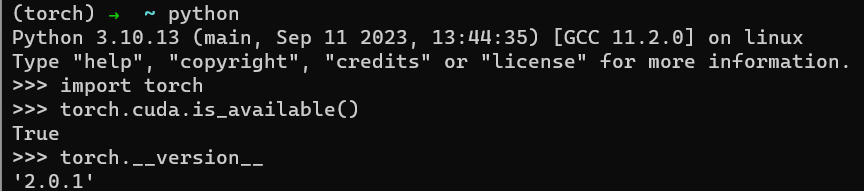

# 服务器IP

3090：10.24.55.96

Dell：10.24.12.200


# Torch

## 安装Miniconda

你需要一个miniconda的安装包，无论是直接在服务器上下载，还是在自己个儿的电脑下载，你只需要一个`Miniconda3-latest-Linux-x86_64.sh`，去[miniconda官网](https://docs.conda.io/projects/miniconda/en/latest/)下载。





把这个安装包放到你用户底下的某个位置后，找到他，并执行

```bash
bash Miniconda3-latest-Linux-x86_64.sh
```

~~回车几次，应该就安装好了。~~

别回车，把安装路径改一下，不然其他用户用不了。

然后，其他用户就能用了。

注意：

1）如果在自己用户里创建环境，仅自己能用；

2）如果在root里创建环境，所有用户均可使用；

## 创建虚拟环境

取个名字，叫torch，指定python版本3.10

```bash
conda create -n torch python=3.10
```

切换到新建的虚拟环境中

```bash
conda activate torch
```

## 安装torch

去[torch官网](https://pytorch.org/)copy指令



```bash
conda install pytorch torchvision torchaudio pytorch-cuda=11.8 -c pytorch -c nvidia
```

## 验证

在torch环境下，进入python，执行

```python
import torch
torch.cuda.is_available()
```



返回True就好。

# Tensorflow

同样的，一条命令搞定

```bash
conda create -n tf-gpu-cuda8 tensorflow-gpu cudatoolkit=10
```

注意，这里不用新建一个tf的虚拟环境了，因为conda-tensorflow已经傻瓜式的把这两句合成一句给我们了，执行完毕后，会生成一个名叫tf-gpu-cuda8的环境，里面有你想要的一切。

这里会有一个问题，可能numpy的版本与其他玩意冲突，安装完毕后，把numpy降到1.22.0

```bash
pip install numpy==1.22
```


